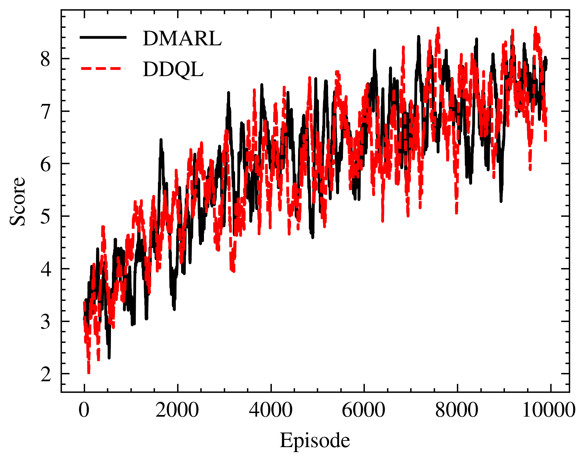
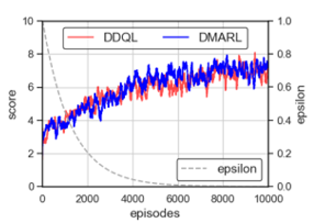
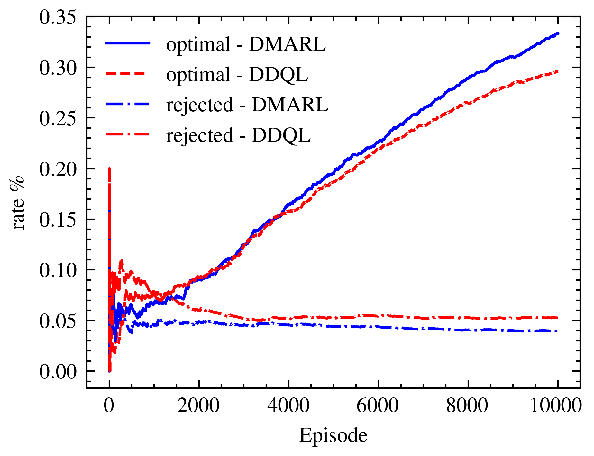
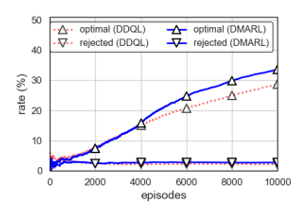

This project is a reimplementation of the paper titled "Deep Multi-Agent Reinforcement Learning With Minimal Cross-Agent Communication
for SFC Partitioning"

Recrated Reward plot

Reward Plot on paper

Optimal percentage recreated

Optimal percentage on paper

